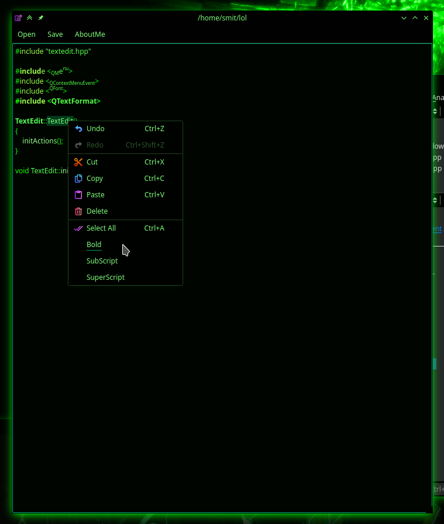

# Text Editor

Editor which can make text bold, superscript and subscript 

## How to build

```bash
git clone https://github.com/LastLightSith/small_texteditor.git
cd small_texteditor
mkdir build
cd build
cmake -DCMAKE_BUILD_TYPE=Release ..
make -j8
```

It will create executable named `Editor` in build directory which you can then run.
cmake and qt development libraries need to be installed.


